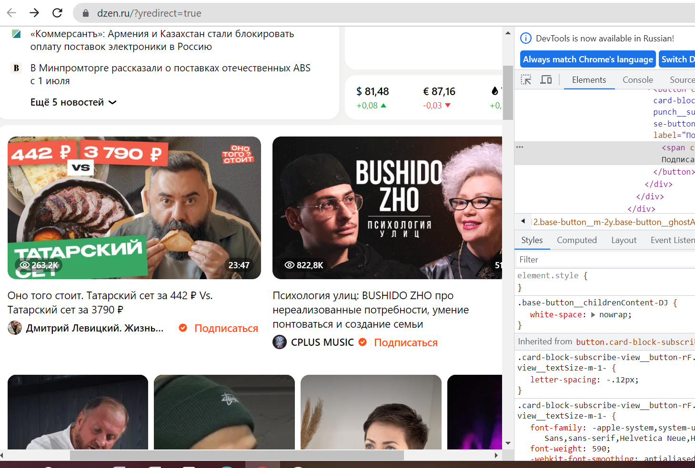
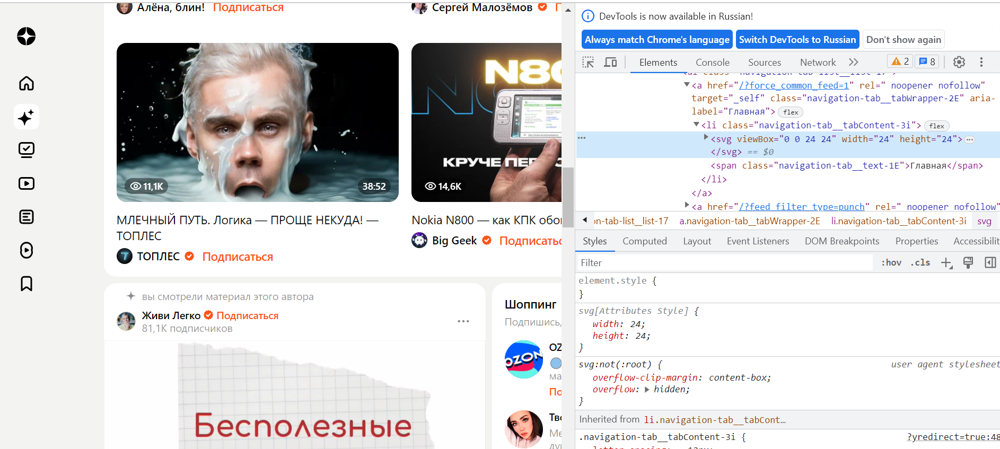

**Задача: на основе сайта**
- Определите, на каком протоколе работает сайт.
- Проанализируйте структуру страницы сайта.
- Внесите не менее 10 изменений на страницу с помощью инструмента разработчика и представьте скриншоты было/стало.
- Задание по желанию необязательное - Создайте прототип низкой детализации (дополнительное задание, если на семинаре дошли до задания №8).

1)По ссылке yandex.ru попадаем на  https://dzen.ru/?yredirect=true, следовательно протокол https – Hyper Text Transfer Protocol+ Secure (защищенный).

2)**Структура страницы сайта:**
В хэдере страницы расположено поле поиска. Далее в центре новостной блок; справа - виджеты(если их так можно назвать) погоды и обменного курса. Слева в виде иконок – панель навигации (главная, витрина, подписки и т.д.). Но справа также есть вторичная навигационная система (лк, уведомления, поиск). 
Тело страницы состоит из уникального контента (видео, картинки с заголовками, анимация).
Футтера/«Подвала» нет (до него не долистаться, страница постоянно догружает контент).

3)Мои внесенные изменения:
1. изменение надписи (подписаться на обниматься):

2. изменение названия ссылки ("скачайте яндекс браузер" - "на будьте добрее!"):

3. изменение-удаление шарика яндекс в рекламе, справа внизу страницы:

без yandexball см. ниже

4. удаление дополнительного блока навигации справа:

5. удаление рекламы установки браузера, справа внизу:

6. изменение цвета виджета погоды:
белый

черный

7. изменение размера и смещение расположения иконки "домой":

домик больше

8. очищенное тело страницы:

9. изменение на темную тему тела страницы:

10. увеличение логотипа дзена:
